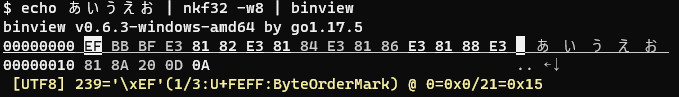

binview - Binary data viewer / editor
========================



Install
--------

Download the binary package from [Releases](https://github.com/hymkor/binview/releases) and extract the executable

Usage
-----

```
$ binview [FILES...]
```

or

```
$ cat FILE | binview
```

Key-binding
-----------

* q , ESCAPE
    * quit
* h , BACKSPACE , ARROW-LEFT , Ctrl-B
    * move the cursor left.
* j , ARROW-DOWN , Ctrl-N
    * move the cursor down.
* k , ARROW-UP , Ctrl-P
    * move the cursor up.
* l , SPACE , ARRIW-RIGHT , Ctrl-F
    * move the cursor right.
* 0(zero) , ^ , Ctrl-A
    * move the cursor to the top of the current line.
* $ , Ctrl-E
    * move the cursor to the tail of the current line.
* &lt;
    * move the cursor to the begin of the file.
* &gt; G
    * move thr cursor to the end of the file.
* r
    * replace one byte
* i
    * insert data (for example: `0xFF`,`U+0000`,`"string"`)
* a
    * append data (for example: `0xFF`,`U+0000`,`"string"`)
* x , DEL
    * delete and yank one byte on the cursor
* p
    * paste 1 byte the rightside of the cursor
* P
    * paste 1 byte the leftside of the cursor
* u
    * undo
* w
    * output to file
* &amp;
    * move the cursor to the address input
* ALT-U
    * Change the character encoding to UTF8 (default)
* ALT-A
    * Change the character encoding to ANSI, the current codepage (Windows-Only)
* ALT-L
    * Change the character encoding to UTF16LE
* ALT-B
    * Change the character encoding to UTF16BE

Release Note
============

- [English](/release_note_en.md)
- [Japanese](/release_note_ja.md)
